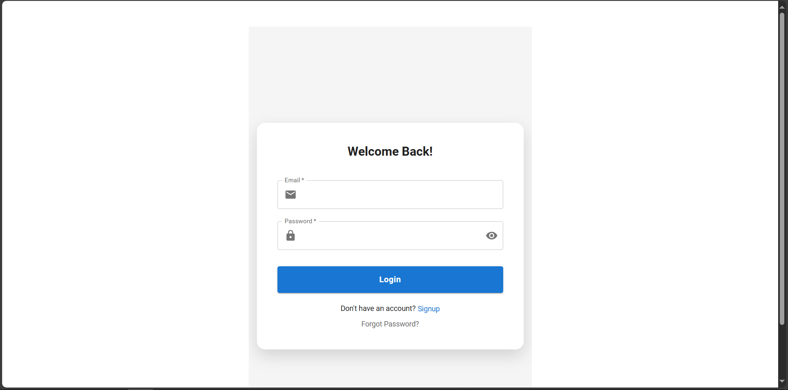
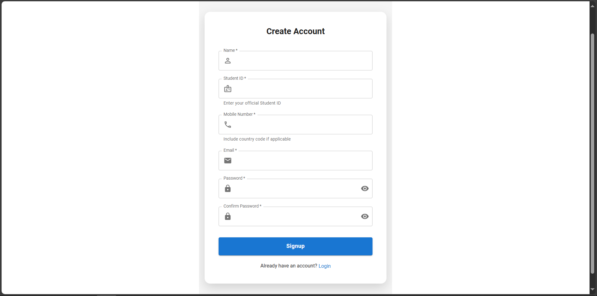
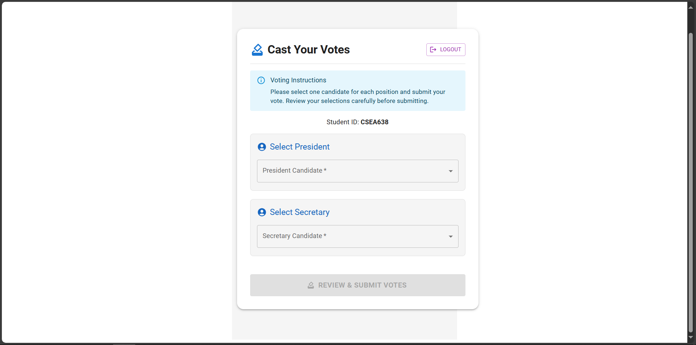
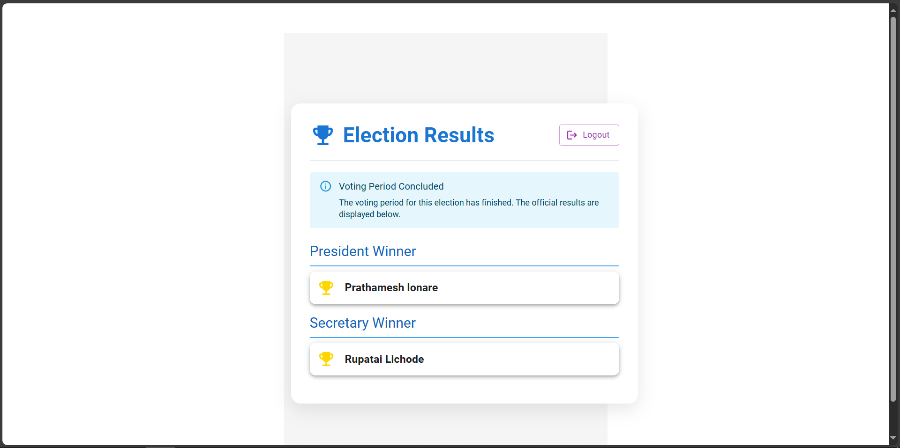
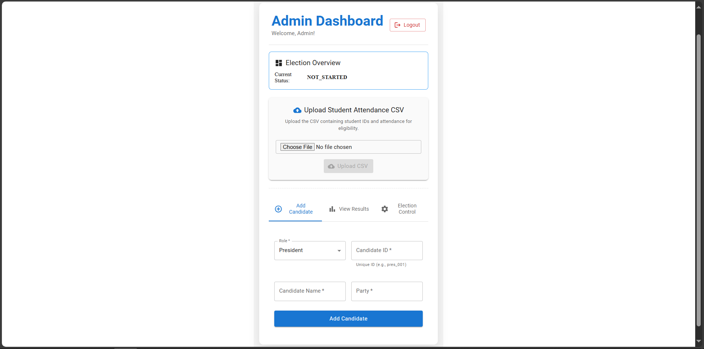
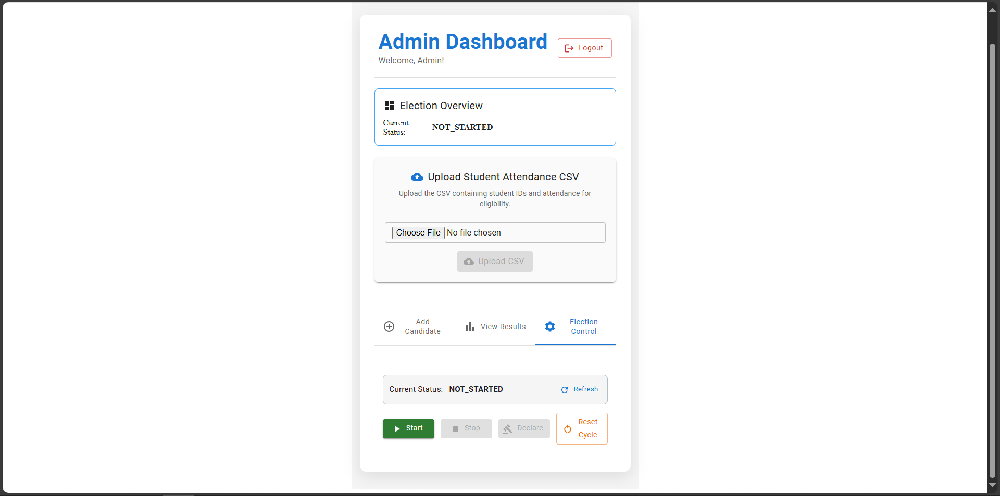

# Rajiv Gandhi College of Engineering, Research & Technology - Voting System

<p align="center">
  
  
  
</p>

## ⚠️ Important Note - Demo Mode

> **This project is currently running in DEMO/PROTOTYPE mode.**
> 
> The original project used AWS Cognito, API Gateway, and S3 for backend services. For this public release, we have replaced all AWS integrations with **mock services** so anyone can download and test the application without needing AWS credentials.
>
> **To connect a real backend:** See the "Connecting Real Backend" section below.

---

## 📌 Project Overview

### Original Intent

This project was developed as a **mega project** for our college **Rajiv Gandhi College of Engineering, Research & Technology (RCERT), Chandrapur** to modernize the traditional **chit-based voting system** for student elections.

### Impact & Achievements

We successfully conducted the college voting election for **500+ students** using this system, which drastically impacted the original chit-based system:

| Before (Chit System) | After (Our System) |
|---------------------|-------------------|
| Manual counting of paper chits | Automatic digital vote counting |
| Time-consuming (hours/days) | Real-time results |
| Prone to human errors | Error-free processing |
| Difficult to verify fairness | Transparent & auditable |
| Physical presence required | Accessible anywhere |
| Limited to college premises | Vote from any device |

### Key Benefits Delivered

- ✅ **Fair & Secure** - No scope for vote manipulation
- ✅ **Time-Efficient** - Reduced election time from days to minutes
- ✅ **Convenient** - Students can vote from any device
- ✅ **Transparent** - Real-time result visibility for admins
- ✅ **Cost-Effective** - No paper, printing, or manual labor costs
- ✅ **Scalable** - Tested with 500+ students, can handle thousands

---

## 🛠️ Tech Stack

| Category | Technology |
|----------|------------|
| Frontend | React 18.2 |
| UI Framework | Material UI (MUI) |
| Routing | React Router v6 |
| Authentication | AWS Cognito (Mocked for demo) |
| API | AWS API Gateway (Mocked for demo) |
| Storage | AWS S3 (Mocked for demo) |
| PDF Generation | jsPDF + jspdf-autotable |

---

## 📁 Project Structure

```
voting-app/
├── src/
│   ├── index.js                    # Application entry point
│   ├── App.js                     # Main app component with routing
│   │
│   ├── mocks/                     # Mock AWS services (for demo)
│   │   ├── index.js               # Exports all mock services
│   │   ├── mockAuth.js            # Mock Cognito authentication
│   │   ├── mockApi.js             # Mock API Gateway responses
│   │   └── mockStorage.js         # Mock S3 storage
│   │
│   └── components/
│       ├── WelcomePage.js          # Landing page
│       ├── AuthForm.js             # Login/Signup form
│       ├── EnterOtp.js             # OTP verification
│       ├── VoteForm.js             # Student voting interface
│       ├── AdminDashboard.js       # Admin control panel
│       └── WelcomePage.js         # Home page
│
├── public/
│   ├── index.html
│   ├── manifest.json
│   └── logo.jpg
│
├── package.json
├── README.md
└── CODE_ANALYSIS_REPORT.txt       # Code analysis report
```

---

## 🚀 Getting Started

### Prerequisites

- Node.js (v14 or higher)
- npm or yarn

### Installation

```bash
# Clone the repository
git clone <your-repo-url>
cd voting-app

# Install dependencies
npm install

# Start development server
npm start
```

The application will open at: **http://localhost:3000**

---

## 🔑 Demo Credentials

| Role | Email | Password |
|------|-------|----------|
| Student | student@rcert.edu | password123 |
| Admin | admin@rcert.edu | admin123 |

### Demo Features

- **Student Login**: Can vote for President and Secretary
- **Admin Login**: Can manage candidates, control election, view results
- **Full Workflow**: Signup → OTP → Login → Vote → View Results

---

## 📋 Features

### For Students
- [x] Secure login/signup with email verification
- [x] Check voting eligibility
- [x] View candidates for President and Secretary
- [x] Cast votes for both positions
- [x] View results after declaration

### For Administrators
- [x] Upload student attendance CSV
- [x] Add/manage election candidates
- [x] Control election status (Start/Stop/Declare)
- [x] View real-time voting results
- [x] Export results as PDF

### Election Management
- **NOT_STARTED** - Initial state
- **RUNNING** - Voting is active
- **STOPPED** - Voting ended, results pending
- **RESULTS_DECLARED** - Results made public

---

## 📸 Screenshots

| Screenshot | Description |
|------------|--------------|
|  | **Login Page** - Secure authentication with email/password |
|  | **Sign Up Page** - Student registration with OTP verification |
|  | **Vote Form** - Cast votes for President and Secretary |
|  | **Results Display** - Real-time voting results visualization |
|  | **Add Candidates** - Admin can add new candidates |
|  | **Election Control** - Start/Stop/Declare election |

---

## 🔌 Connecting Real Backend

To connect this demo to a real AWS backend:

1. **Create AWS Resources:**
   - AWS Cognito User Pool
   - API Gateway REST API
   - Lambda functions for voting logic
   - S3 bucket for CSV storage

2. **Configure Credentials:**
   ```javascript
   // src/aws-exports.js
   const awsExports = {
     Auth: {
       region: 'us-east-1',
       userPoolId: 'us-east-1_YOUR_USER_POOL_ID',
       userPoolWebClientId: 'YOUR_CLIENT_ID',
       identityPoolId: 'us-east-1:YOUR_IDENTITY_POOL_ID'
     },
     API: {
       endpoints: [{
         name: "voteApi",
         endpoint: "https://YOUR_API_ID.execute-api.us-east-1.amazonaws.com/prod",
         region: "us-east-1",
         authorizationType: "COGNITO_USER_POOLS"
       }]
     },
     Storage: {
       AWSS3: {
         bucket: 'your-bucket-name',
         region: 'us-east-1'
       }
     }
   };
   export default awsExports;
   ```

3. **Update Imports:**
   - In `src/index.js`: Import from `aws-amplify` instead of `./mocks`
   - Update all component imports similarly

---

## 👥 Team Members

| Name | Role | Responsibilities |
|------|------|------------------|
| Prathamesh Lonare | **Project Lead & Frontend Developer** | Project planning, React UI development, component architecture |
| Swapnil Kumbhare | **DevOps & Security** | AWS deployment, Cognito authentication, CSV processing |
| Mohak Talodhikar | **Backend Developer** | AWS Lambda functions, API Gateway, database design |
| Suyog Madavi | **UI/UX Designer** | User experience, Material UI styling, responsive design |

---

## 📄 License

This project is available for educational purposes and as a portfolio demonstration.

---

## 🙏 Acknowledgments

- **RCERT (Rajiv Gandhi College of Engineering, Research & Technology)** - For giving us the opportunity to implement this system
- **Our Guides** - For their continuous support and guidance
- **Open Source Community** - For the amazing tools and libraries

---

<p align="center">
  Made with ❤️ by RCERT Students
</p>
